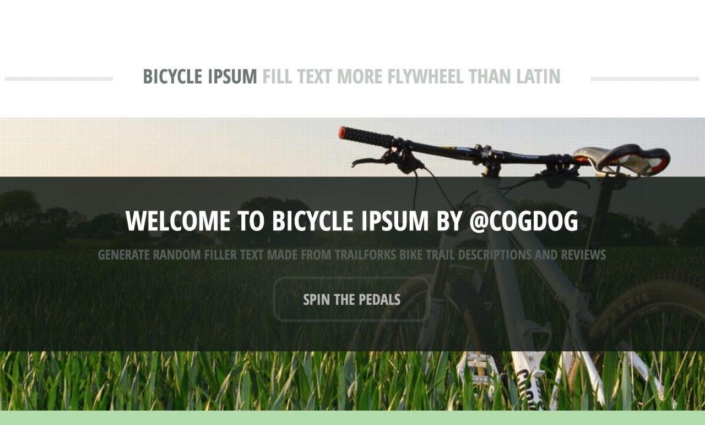

# Bicycle Ipsum

*a gizmo by @cogdog | http://cog.dog* 

A  lorem ipsum generator of stuff from the public domain books about bicycles. Because we always need more generators... [Take a ride now](https://cogdog.github.io/bicycle-ipsum/). Why? Well [there was a reason](http://cogdogblog.com/2017/10/bike-trail-lorem-ipsum/).

You can slip the granny gear on to do tricks this:

> The bottom portion of the trail is fast, loose and tight. Starts pretty mellow, then gets steeper and has a few drops. drop to give you an idea of what you're getting into. If you continue, the trail ends at one of the lakes and continues lakeside until reaching the point where you began the trail The lake-side bit is fairly technical and very fun. This is a shuttle access downhill trail that is suitable for all ages and multiple different bike styles- although best suited for all mountain, dirtjumper or full on DH bikes.

> Sight lines are fantastic and the flow is amazing. This created a reroute of the single track. For those that want to get tricksy, there are jumps littered throughout the trail as well. Better yet, don't do it unless other people are pretty confident in your fitness. Removable by hand saw.

This is based on [the CC-IPSUM generator I made earlier](https://cogdog.github.io/cc-ipsum/) -- there is also a basic unformatted [Simple Ipsum](https://github.com/cogdog/simple-ipsum/).

